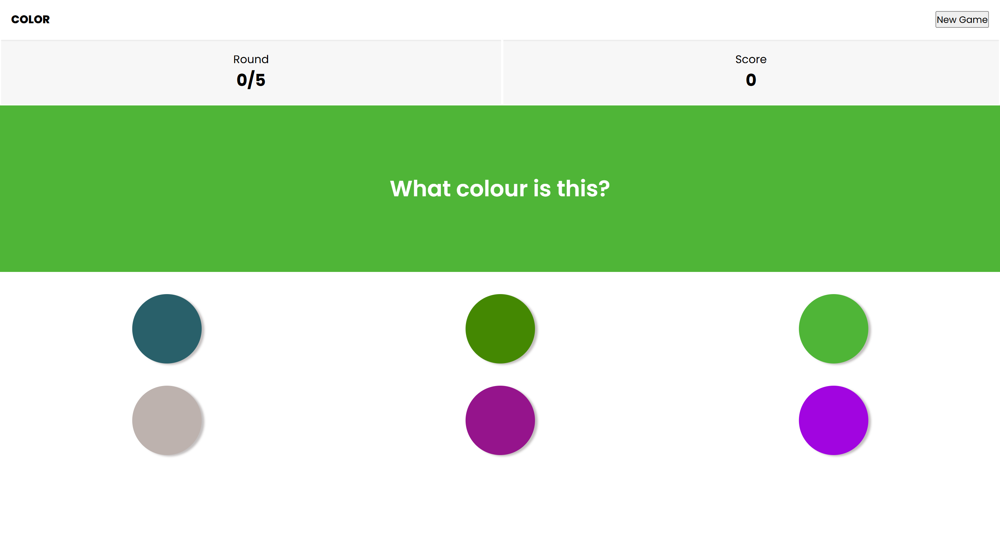

# KOLOR 🎨 - Color Perception Challenge Game

## Overview

KOLOR is an engaging web-based game that tests and improves your color perception skills. Players are challenged to identify the correct color from a set of randomly generated RGB colors, making it both a fun and educational experience.



## 🌟 Features

- **Random Color Generation**: Each round generates unique RGB colors
- **Score Tracking**: Keep track of your correct guesses
- **Multiple Rounds**: Play through 5 rounds per game
- **Performance Tiers**: Get rated based on your color recognition accuracy
- **Responsive Design**: Playable on desktop and mobile devices

## 🛠 Tech Stack

- **Frontend**: React
- **Language**: TypeScript
- **Styling**: CSS

## 🚀 Getting Started

### Prerequisites

- Node.js (v14 or later)
- npm (v6 or later)

### Installation

1. Clone the repository

```bash
git clone https://github.com/jane-ahone/Color-Game.git

```

2. Install dependencies

```bash
npm install
```

3. Start the development server

```bash
npm run dev
```

4. Open `http://localhost:5173` in your browser

## 🎮 How to Play

1. A target color will be displayed
2. Choose the correct color from the 6 options
3. Earn points for correct guesses
4. Complete 5 rounds to see your performance summary

## 🌈 Color Generation Algorithm

The game uses a simple RGB color generation algorithm:

- Generates random values between 0-255 for Red, Green, and Blue
- Creates unique color combinations

## 🏆 Performance Tiers

- **Color Master**: 80%+ accuracy
- **Color Pro**: 60-80% accuracy
- **Color Learner**: 40-60% accuracy
- **Color Novice**: < 40% accuracy
